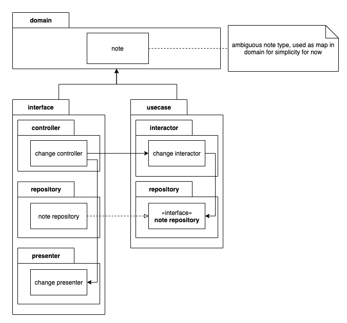
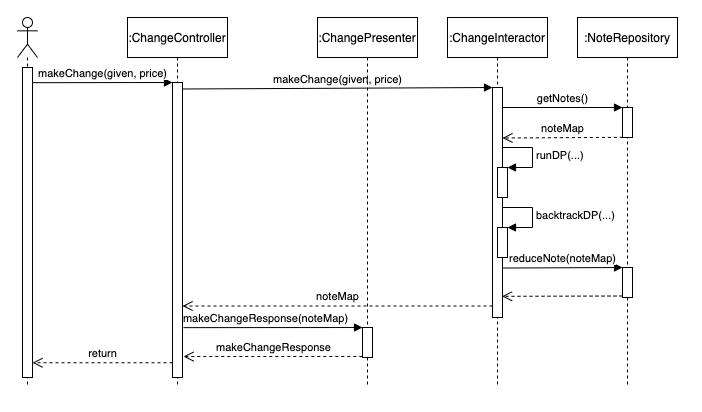

# make-change
<h2>run project</h2>

***for simplicity, note denominations and their amount are configured in ./app/main.go***

<ol>
  <li>
    
build

    <code>go build -o make-change ./app/*.go</code>
  </li>
  <li>
    
run application(port 3000)

    <code>./make-change</code>
  </li>
</ol>
<h2>API documentation</h2>
<pre>
api:
└───create URL:
│   │ POST {app-url}/
│   │ body: {
│   │   given: float64
│   │   price: float64
│   │ }
│   │ response: [
│   │   {
│   │     note: 100,
│   │     amount: 2
│   │   },
│   │   {
│   │     note: 10,
│   │     amount: 3
│   │   },
│   │   ....
│   │ ]

</pre>
<h2>architecture</h2>

<h2>make change use case sequence diagram</h2>

